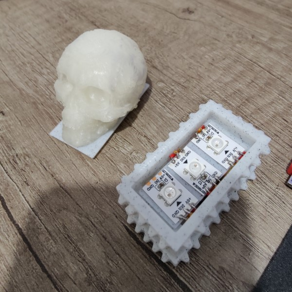

# Light-Up Chest

A simple light up chest for an AtTiny 85

* base.FCStd - FreeCAD source ([Realthunder FreeCad](https://github.com/realthunder/FreeCAD/releases))
* flames.ino - Simple Arduino Sketch to simulate flames

## Prerequisites

* [FastLED](http://fastled.io/)
* [Digikey AtTiny85 Library](http://digistump.com/wiki/)

## Usage

* Data pin from WS2812B on P0
* Use short wires
* Build and deploy Sketch from [Arduino IDE](https://www.arduino.cc/en/software)

## Contributing
* Project is considered final.  Free to fork, please contact before opening a pull request.

## License
[MIT](https://choosealicense.com/licenses/mit/)